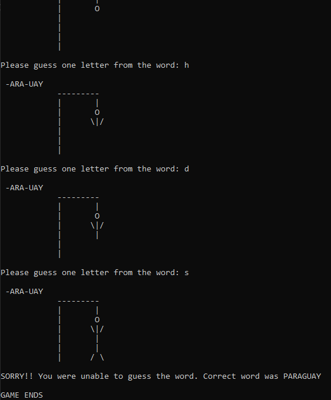

# Hangman Game - Python
## Version 1.01
### Built with Python
### Link to the repository https://github.com/jamwalab/Hangman-Game-Python.git

### Project description
* Random word is picked from the worl list (currently filled with Country names.)
* The word is replaced by dashes except for one random letter that is revealed as hint.
* This letter along with any future letter guessed are stored in a dictionary.
* Guess can only be one letter and cannot be repeated (checks in place!)
* For every correct guess the letter is revealed.
* Only five wrong answers are allowed, each worng answer goes through the five stages of the list in the stages function.
* Final message for a win or loss is printed before the game ends.